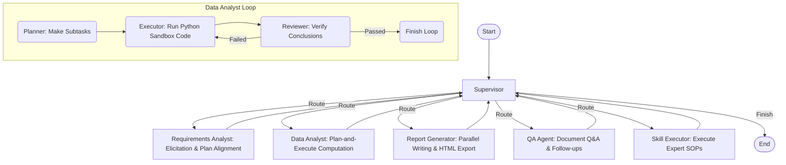

# 📊 Datation - Auto Data Analyst

<p align="center">
  <a href="README.md">English</a> | <a href="README_zh.md">简体中文</a>
</p>

---

[](https://github.com/aning35/datation/releases)
[](https://www.python.org/downloads/)
[](https://nodejs.org/)
[](LICENSE)
[](https://github.com/aning35/datation/pulls)

**Datation** is a state-of-the-art autonomous data analysis system powered by **Multi-Agent Orchestration**. Utilizing **LangGraph** as the core scheduling orchestrator, it seamlessly integrates **MCP (Model Context Protocol)**, custom **Agent Skills**, and **Docling** high-fidelity document parsing. It manages the entire lifecycle of data tasks—from vague, open-ended requirements to sophisticated, interactive HTML analytical reports.

Datation provides a highly responsive, feature-rich Web workspace with seamless trace logging, state snapshots, and detailed logs, offering an unparalleled agent developer and user experience.

> 📸 **Visual Walkthrough**: Check out our complete [UI & Features Screenshots Gallery](docs/screenshots.md) to explore the workspace visually!

---

### 🚀 Key Features

#### 🎭 1. Multi-Agent Orchestration (Supervisor-Workers)
* **Supervisor**: The core orchestrator managing intents, global routing, and task dispatching.
* **RequirementsAnalyst**: Handles requirement elicitation, interactive user interviews, and multi-turn plan alignment.
* **DataAnalyst**: Employs a robust **Plan-and-Execute** pattern, running within a secure Python calculation sandbox with a dedicated **Reviewer** loop to verify all conclusions against raw data.
* **ReportGenerator**: Generates comprehensive analysis chapters in parallel, prevents duplicate findings, and compiles them into a premium HTML report.
* **QAAgent**: Answers instant follow-up questions, clarifies details based on the generated reports, and manages long-term user preferences.
* **SkillExecutor**: Executes domain-specific standard operating procedures (SOPs) defined in Agent Skills (`SKILL.md`) dynamically.

#### 🧠 2. Deep Reasoning & Self-Correction
* **Closed-loop Diagnostics**: Triggers self-correction upon code execution failures to automatically seek alternative strategies.
* **Review Verification**: Enforces strict verification of code and intermediate data insights.
* **Thinking Mode Toggle**: Native support for reasoning/thinking models (DeepSeek V4). Includes a beautiful front-end `enable_thinking` toggle to switch LLM pipelines dynamically.

#### 🛠️ 3. Rich Toolchain
* **Data Computation Sandbox**: Isolated environment pre-loaded with `pandas`, `numpy`, `matplotlib`, `openpyxl`, etc.
* **Local File Writer**: A highly secure, constrained writer tool that registers reports and clean datasets to a local `./outputs` archive without escaping the sandbox.
* **Shell Executor**: Controlled command line operations.
* **Web & Knowledge Search**: Integrated search engines and local vector database knowledge retrieval.
* **Memory & Session System**: Captures long-term user preferences in `user_preferences.json` (administered via the QA Agent) and short-term mid-session ReAct experiences in `session_memory.jsonl` to avoid repeating computational errors.

#### 🗂️ 4. High-Fidelity Document Parsing
* Built-in **Docling** engine for parsing PDF, Excel, Word, PPTX, and HTML with superior table restoration.

#### 🔌 5. Open Extensibility & Zero-Config Demo
* **Model Context Protocol (MCP)**: Native support for external MCP servers to easily expand the system's capabilities.
* **Zero-Config Setup**: Automatically bootstraps a SQLite e-commerce database (`~/.datation/demo_data.db`) pre-loaded with comprehensive synthetic sales history (20 customers, 12 categories, 24 products, 200 orders, ~381 items) on first startup, mapped instantly to an auto-generated MCP SQLite server via `uvx`.
* **Agent Skills**: Dynamically load domain-specific expert guidelines (`SKILL.md`) in Markdown.
* **Universal LLM Integration**: Multi-provider support via LiteLLM (DeepSeek, OpenAI, OpenRouter).

#### 🖥️ 6. Premium User Experience (UX)
* **Visual File Browser**: Interactive directories selector built right into the settings panel.
* **Skill Marketplace**: Instantly browse, fetch, and install community skills from remote GitHub repositories.
* **Interactive Suggestions**: Prompts 3 creative, highly tailored analytical recommendations as soon as you upload any dataset.
* **Conversation Rollback**: Roll back the conversation thread to any previous turn seamlessly, automatically resetting LangGraph states, stream logs (with backups), and supervisor routing.
* **Workspace Search (⌘K)**: Global command and conversation search bar.
* **Live Token Tracker & Log Streaming**: Visual per-agent token breakdown (input, completion, reasoning) and real-time backend trace streams.

---

### 📐 System Architecture & Workflow



---

### 📂 Project Structure

```text
datation/
├── datation/                # Python backend codebase
│   ├── agents/              # Multi-agent graph definitions (Supervisor, Workers, Prompts)
│   ├── api/                 # FastAPI routes, SSE streams, suggestions, and rollback
│   ├── core/                # Configuration, state, & reasoning model wrappers
│   ├── locales/             # Backend i18n translation bundles (zh.json, en.json)
│   ├── utils/               # Common utilities and document loaders (Docling)
│   ├── main.py              # Server entry point
│   ├── mcp_client.py        # MCP client server communication managers
│   └── skill_loader.py      # Dynamic Agent Skills card loader
├── frontend/                # React 19 + Vite + Tailwind v4 frontend client
│   ├── src/components/      # UI Dashboard tabs (Chat, Plan, Files, Settings, Logs, Workflow, Search, Token)
│   ├── src/i18n/            # Frontend translations
│   ├── package.json         # Frontend manifest
│   └── vite.config.ts       # Vite build configurations
├── scripts/                 # Automation & helper scripts
│   ├── seed_data.sql        # Standard PostgreSQL seed SQL
│   ├── seed_demo_db.py      # SQLite e-commerce demo database generator
│   ├── setup_cn.sh          # Chinese-friendly environment one-click installer (macOS/Linux)
│   └── setup_cn.bat         # Chinese-friendly environment one-click installer (Windows)
├── skills/                  # Expert SOP directories (Agent Skills)
├── tools/                   # Isolated tools
│   ├── data_computation/    # Isolated Python sandbox environment
│   ├── knowledge_search/    # Local knowledge base search index
│   ├── local_file_reader/   # Safe document reading tool
│   ├── local_file_writer/   # Safe local report writing tool
│   ├── memory/              # Dual memory system (Preferences & Session Experience)
│   ├── shell_executor/      # Controlled command line runner
│   └── web_search/          # Search provider integrations
├── tests/                   # Automated unit & integration tests
├── start.sh                 # One-click startup script (macOS/Linux)
├── start.bat                # One-click startup script (Windows)
├── start.py                 # Cross-platform startup script (Python)
├── pyproject.toml           # Python uv dependencies configuration
└── uv.lock                  # Lockfile
```

---

### 🛠️ Quick Start

#### 1. Prerequisites
Ensure you have `Python 3.12+` and `Node.js 20+` installed.

We strongly recommend [uv](https://github.com/astral-sh/uv) to manage Python packages:
```bash
curl -LsSf https://astral-sh/uv/install.sh | sh
```

#### 2. Environment Configuration
1. Duplicate the environment template:
   ```bash
   cp .env.example .env
   ```
2. Configure settings under `~/.datation/config/app.json` or inside the Web UI **Settings** panel.
3. Configure your `LLM_API_KEY` and `LLM_API_BASE`. For instance, using DeepSeek:
   ```json
   {
     "llm_model": "deepseek-v4-pro",
     "llm_api_base": "https://api.deepseek.com",
     "llm_api_key": "your_api_key_here"
   }
   ```

> [!TIP]
> **Zero-Config Demo Setup**: You do not need to configure any external database on your first startup. Datation automatically seeds a beautiful SQLite database (`demo_data.db` under your user directory) and mounts it via the SQLite MCP server. You only need to provide an LLM API Key to start asking questions like "Analyze the e-commerce sales trends for 2024" immediately!

#### 3. Run the Project
Launch both the FastAPI backend server and the React frontend workspace:
```bash
# macOS / Linux
chmod +x start.sh
./start.sh

# Windows
start.bat

# Or cross-platform via Python
python start.py
```

Access the application:
* 🌟 **Web Workspace**: [http://localhost:1420](http://localhost:1420)
* 📡 **FastAPI Server**: [http://localhost:18321](http://localhost:18321)

#### 🇨🇳 Chinese Network Optimization Setup
If you are running in a Chinese network environment with PyPI or NPM download speed constraints, you can bootstrap the environment with our specialized one-click installer using fast domestic mirrors:
```bash
# macOS / Linux
chmod +x scripts/setup_cn.sh
./scripts/setup_cn.sh

# Windows (Command Prompt)
scripts\setup_cn.bat
```
This automatically installs the required runtimes (if missing) and configures **Tsinghua PyPI mirrors** for `uv`/`pip`, and **Taobao npm mirrors** for React frontend packages!
