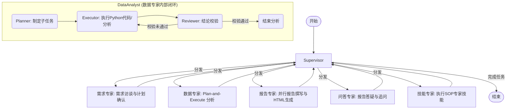

# 📊 Datation - Auto Data Analyst / 自动数据分析智能体

<p align="center">
  <a href="#english">English</a> | <a href="#简体中文">简体中文</a>
</p>

---

<a name="english"></a>

## English

[](https://github.com/aning35/datation/releases)
[](https://www.python.org/downloads/)
[](https://nodejs.org/)
[](LICENSE)
[](https://github.com/aning35/datation/pulls)

**Datation** is a state-of-the-art autonomous data analysis system powered by **Multi-Agent Orchestration**. Utilizing **LangGraph** as the core scheduling orchestrator, it seamlessly integrates **MCP (Model Context Protocol)**, custom **Agent Skills**, and **Docling** high-fidelity document parsing. It manages the entire lifecycle of data tasks—from vague, open-ended requirements to sophisticated, interactive HTML analytical reports.

Datation provides a highly responsive, feature-rich Web workspace with seamless trace logging, state snapshots, and detailed logs, offering an unparalleled agent developer and user experience.

> 📸 **Visual Walkthrough**: Check out our complete [UI & Features Screenshots Gallery](docs/screenshots.md) to explore the workspace visually!

---

### 🚀 Key Features

#### 🎭 1. Multi-Agent Orchestration (Supervisor-Workers)
* **Supervisor**: The core orchestrator managing intents, global routing, and task dispatching.
* **RequirementsAnalyst**: Handles requirement elicitation, interactive user interviews, and multi-turn plan alignment.
* **DataAnalyst**: Employs a robust **Plan-and-Execute** pattern, running within a secure Python calculation sandbox with a dedicated **Reviewer** loop to verify all conclusions against raw data.
* **ReportGenerator**: Generates comprehensive analysis chapters in parallel, prevents duplicate findings, and compiles them into a premium HTML report.
* **QAAgent**: Answers instant follow-up questions, clarifies details based on the generated reports, and manages long-term user preferences.
* **SkillExecutor**: Executes domain-specific standard operating procedures (SOPs) defined in Agent Skills (`SKILL.md`) dynamically.

#### 🧠 2. Deep Reasoning & Self-Correction
* **Closed-loop Diagnostics**: Triggers self-correction upon code execution failures to automatically seek alternative strategies.
* **Review Verification**: Enforces strict verification of code and intermediate data insights.
* **Thinking Mode Toggle**: Native support for reasoning/thinking models (DeepSeek V4). Includes a beautiful front-end `enable_thinking` toggle to switch LLM pipelines dynamically.

#### 🛠️ 3. Rich Toolchain
* **Data Computation Sandbox**: Isolated environment pre-loaded with `pandas`, `numpy`, `matplotlib`, `openpyxl`, etc.
* **Local File Writer**: A highly secure, constrained writer tool that registers reports and clean datasets to a local `./outputs` archive without escaping the sandbox.
* **Shell Executor**: Controlled command line operations.
* **Web & Knowledge Search**: Integrated search engines and local vector database knowledge retrieval.
* **Memory & Session System**: Captures long-term user preferences in `user_preferences.json` (administered via the QA Agent) and short-term mid-session ReAct experiences in `session_memory.jsonl` to avoid repeating computational errors.

#### 🗂️ 4. High-Fidelity Document Parsing
* Built-in **Docling** engine for parsing PDF, Excel, Word, PPTX, and HTML with superior table restoration.

#### 🔌 5. Open Extensibility & Zero-Config Demo
* **Model Context Protocol (MCP)**: Native support for external MCP servers to easily expand the system's capabilities.
* **Zero-Config Setup**: Automatically bootstraps a SQLite e-commerce database (`~/.datation/demo_data.db`) pre-loaded with comprehensive synthetic sales history (20 customers, 12 categories, 24 products, 200 orders, ~381 items) on first startup, mapped instantly to an auto-generated MCP SQLite server via `uvx`.
* **Agent Skills**: Dynamically load domain-specific expert guidelines (`SKILL.md`) in Markdown.
* **Universal LLM Integration**: Multi-provider support via LiteLLM (DeepSeek, OpenAI, OpenRouter).

#### 🖥️ 6. Premium User Experience (UX)
* **Visual File Browser**: Interactive directories selector built right into the settings panel.
* **Skill Marketplace**: Instantly browse, fetch, and install community skills from remote GitHub repositories.
* **Interactive Suggestions**: Prompts 3 creative, highly tailored analytical recommendations as soon as you upload any dataset.
* **Conversation Rollback**: Roll back the conversation thread to any previous turn seamlessly, automatically resetting LangGraph states, stream logs (with backups), and supervisor routing.
* **Workspace Search (⌘K)**: Global command and conversation search bar.
* **Live Token Tracker & Log Streaming**: Visual per-agent token breakdown (input, completion, reasoning) and real-time backend trace streams.

---

### 📐 System Architecture & Workflow


---

### 📂 Project Structure

```text
datation/
├── datation/                # Python backend codebase
│   ├── agents/              # Multi-agent graph definitions (Supervisor, Workers, Prompts)
│   ├── api/                 # FastAPI routes, SSE streams, suggestions, and rollback
│   ├── core/                # Configuration, state, & reasoning model wrappers
│   ├── locales/             # Backend i18n translation bundles (zh.json, en.json)
│   ├── utils/               # Common utilities and document loaders (Docling)
│   ├── main.py              # Server entry point
│   ├── mcp_client.py        # MCP client server communication managers
│   └── skill_loader.py      # Dynamic Agent Skills card loader
├── frontend/                # React 19 + Vite + Tailwind v4 frontend client
│   ├── src/components/      # UI Dashboard tabs (Chat, Plan, Files, Settings, Logs, Workflow, Search, Token)
│   ├── src/i18n/            # Frontend translations
│   ├── package.json         # Frontend manifest
│   └── vite.config.ts       # Vite build configurations
├── scripts/                 # Automation & helper scripts
│   ├── seed_data.sql        # Standard PostgreSQL seed SQL
│   ├── seed_demo_db.py      # SQLite e-commerce demo database generator
│   ├── setup_cn.sh          # Chinese-friendly environment one-click installer (macOS/Linux)
│   └── setup_cn.bat         # Chinese-friendly environment one-click installer (Windows)
├── skills/                  # Expert SOP directories (Agent Skills)
├── tools/                   # Isolated tools
│   ├── data_computation/    # Isolated Python sandbox environment
│   ├── knowledge_search/    # Local knowledge base search index
│   ├── local_file_reader/   # Safe document reading tool
│   ├── local_file_writer/   # Safe local report writing tool
│   ├── memory/              # Dual memory system (Preferences & Session Experience)
│   ├── shell_executor/      # Controlled command line runner
│   └── web_search/          # Search provider integrations
├── tests/                   # Automated unit & integration tests
├── start.sh                 # One-click startup script (macOS/Linux)
├── start.bat                # One-click startup script (Windows)
├── start.py                 # Cross-platform startup script (Python)
├── pyproject.toml           # Python uv dependencies configuration
└── uv.lock                  # Lockfile
```

---

### 🛠️ Quick Start

#### 1. Prerequisites
Ensure you have `Python 3.12+` and `Node.js 20+` installed.

We strongly recommend [uv](https://github.com/astral-sh/uv) to manage Python packages:
```bash
curl -LsSf https://astral-sh/uv/install.sh | sh
```

#### 2. Environment Configuration
1. Duplicate the environment template:
   ```bash
   cp .env.example .env
   ```
2. Configure settings under `~/.datation/config/app.json` or inside the Web UI **Settings** panel.
3. Configure your `LLM_API_KEY` and `LLM_API_BASE`. For instance, using DeepSeek:
   ```json
   {
     "llm_model": "deepseek-v4-pro",
     "llm_api_base": "https://api.deepseek.com",
     "llm_api_key": "your_api_key_here"
   }
   ```

> [!TIP]
> **Zero-Config Demo Setup**: You do not need to configure any external database on your first startup. Datation automatically seeds a beautiful SQLite database (`demo_data.db` under your user directory) and mounts it via the SQLite MCP server. You only need to provide an LLM API Key to start asking questions like "Analyze the e-commerce sales trends for 2024" immediately!

#### 3. Run the Project
Launch both the FastAPI backend server and the React frontend workspace:
```bash
# macOS / Linux
chmod +x start.sh
./start.sh

# Windows
start.bat

# Or cross-platform via Python
python start.py
```

Access the application:
* 🌟 **Web Workspace**: [http://localhost:1420](http://localhost:1420)
* 📡 **FastAPI Server**: [http://localhost:18321](http://localhost:18321)

#### 🇨🇳 Chinese Network Optimization Setup
If you are running in a Chinese network environment with PyPI or NPM download speed constraints, you can bootstrap the environment with our specialized one-click installer using fast domestic mirrors:
```bash
# macOS / Linux
chmod +x scripts/setup_cn.sh
./scripts/setup_cn.sh

# Windows (Command Prompt)
scripts\setup_cn.bat
```
This automatically installs the required runtimes (if missing) and configures **Tsinghua PyPI mirrors** for `uv`/`pip`, and **Taobao npm mirrors** for React frontend packages!

---

<a name="简体中文"></a>

## 简体中文

[](https://github.com/aning35/datation/releases)
[](https://www.python.org/downloads/)
[](https://nodejs.org/)
[](LICENSE)
[](https://github.com/aning35/datation/pulls)

**Datation** 是一个基于 **Multi-Agent Orchestration (多智能体编排)** 架构的深度数据分析系统。它利用 **LangGraph** 作为核心调度引擎，集成了 **MCP (Model Context Protocol)**、**Agent Skills (智能体技能库)**、以及 **Docling** 高级文档解析能力，能够处理从需求模糊调研到输出专业可视化分析报告的全流程任务。

项目提供了现代化、全响应式的 Web 控制台，具备精致的微交互与流畅的全局状态追踪，为用户带来极致的数据分析与智能体调试体验。

> 📸 **视觉展示**: 欢迎访问完整的 [功能与界面截图画廊](docs/screenshots.md) 直观浏览工作区各项功能！

---

### 🚀 核心特性

#### 🎭 1. 多智能体协同架构 (Multi-Agent System)
系统采用 **Supervisor-Workers** 架构进行精密分工：
- **Supervisor (决策编排者)**: 核心 Orchestrator，负责全局路由、用户意图识别与任务分发。
- **RequirementsAnalyst (需求专家)**: 负责模糊需求调研与访谈，支持多轮 Clarification 与计划确认。
- **DataAnalyst (数据专家)**: 采用 **Plan-and-Execute (规划与执行)** 模式，自带安全的 **Python 计算沙箱**，支持深度数据挖掘与图表绘制，并引入 **Reviewer (审查者)** 机制，确保每一个结论都有数据支撑。
- **ReportGenerator (报告专家)**: 分章节并行撰写，支持智能去重，自动整合图表及分析结论，产出精美的高级 HTML 分析报告。
- **QAAgent (问答助手)**: 针对已分析成果和生成报告提供即时的追问与疑点解答，同时充当行政小助手管理用户的长期偏好记忆。
- **SkillExecutor (SOP/技能执行专家)**: 动态解析并严格执行符合 Agent Skills 标准的 Markdown 专家技能卡片（`SKILL.md`）。

#### 🧠 2. 深度推理与自修复 (Deep Reasoning & Self-Correction)
- **闭环诊断**: 代码执行失败时触发闭环诊断并自动寻求备用策略（如重试、换用算法、修正数据格式）。
- **审查校验**: 强制执行 Reviewer 机制，对生成的代码与中间结论进行多轮交叉验证。
- **思考模式一键切换**: 原生支持 DeepSeek V4 等深度推理模型。前端提供 `enable_thinking` 开关，可在“极速分析”与“深度思考”模式之间无缝切换，并在界面中呈现完整的 `<thinking>` 思维链。

#### 🛠️ 3. 丰富的底层工具链 (Rich Toolchain)
- **Data Computation**: 隔离的 Python 沙箱环境，预装 `pandas`、`numpy`、`matplotlib`、`openpyxl` 等分析库。
- **Local File Writer**: 安全可控的本地文件写入工具 `local_file_writer`，将高价值的 Markdown 报告和清洗后的 CSV/JSON 数据保存至 `./outputs` 安全归档，杜绝沙箱越界。
- **Shell Executor**: 提供安全可控的终端命令执行能力。
- **Web & Knowledge Search**: 整合网络搜索引擎与本地知识库检索能力。
- **Memory System**: 独创双重记忆系统。包含长期记忆偏好 (`user_preferences.json`，由 QA 智能体维护) 与会话经验沉淀 (`session_memory.jsonl`，自动记录代码报错修复轨迹)，确保智能体在对话中“吃一堑长一智”。

#### 🗂️ 4. 高保真文档处理 (High-Fidelity Parsing)
- 集成 **Docling** 引擎，支持 PDF、Excel、Word、PPTX、HTML 等多种格式的深度解析与高保真表格还原。

#### 🔌 5. 开放生态与零配置启动 (Zero-Config Demo)
- **MCP (Model Context Protocol)**: 原生支持加载外部 MCP Servers，无缝挂载自定义工具库或数据库，无限扩展智能体能力边界。
- **零配置开箱即用**: 首次启动时，Datation 会在用户主目录下自动生成一个 SQLite 演练数据库 (`~/.datation/demo_data.db`)，其中预装了仿真电商订单数据（包含 20 个核心客户、12 个商品分类、24 款热销单品、200+ 笔电商订单和 ~381 条明细）。系统将自动配置并使用 `uvx` 自动拉起 MCP SQLite 挂载此数据库。
- **Agent Skills**: 支持通过 Markdown 定义并动态加载领域专家 SOP 技能库 (`SKILL.md`)。
- **LLM 多平台支持**: 通过 LiteLLM 支持 DeepSeek、OpenAI、OpenRouter 等任意提供 OpenAI 兼容 API 的模型。

#### 🖥️ 6. 极致的前端交互体验 (Premium UX)
- **可视化文件浏览器**: 设置面板内置可视化目录选择器，直观选择本地数据库或工作区目录。
- **技能卡片市场**: 内置 Agent Skills 社区市场，支持一键拉取并安装远程 GitHub 仓库中的 Markdown 技能。
- **智能分析推荐**: 独创智能文件上传反馈，一键上传任何数据文件，基于 `suggestions/from-file` API 瞬间为用户生成 3 条极具洞察力的定制分析方向。
- **无损会话回滚**: 允许用户对对话树中的任意历史消息进行一键回滚。系统后台将自动截断 LangGraph 状态、裁切 SSE 流日志 `stream_logs.jsonl`（自动保存 `.bak.N` 顺序备份）、重置 Supervisor 路由状态并清理活动计划。
- **全局搜索 (⌘K)**: 精美的命令行和侧边栏全局检索，秒级切换会话与指令。
- **智能体 Token 看板**: 实时展示 Supervisor、DataAnalyst、ReportGenerator 等各智能体节点的 Token 消耗明细与估算成本。
- **实时日志流面板**: 独立的开发者日志面板，流式呈现 SQL 执行、Python 计算及 LLM 原生报文。
- **人机协同确认关卡**: 当智能体执行写入高价值文件或敏感 Shell 命令时，前端提供交互式安全确认门闸。
- **一键热重启**: 支持在设置中一键重启后台服务，包含优雅的国际化通知、120 秒高容错健康检测轮询与状态自动恢复。

---

### 📐 系统架构与工作流



---

### 📂 工程目录结构

```text
datation/
├── datation/                # Python 后端核心代码
│   ├── agents/              # 智能体核心定义 (Supervisor, Workers, Prompts)
│   ├── api/                 # FastAPI 路由、SSE 消息流、智能推荐及回滚
│   ├── core/                # 全局配置管理、状态定义与思考模型包装
│   ├── locales/             # 后端多语言国际化文件 (zh.json, en.json)
│   ├── utils/               # 通用工具类与文档处理器 (Docling)
│   ├── main.py              # 服务端启动入口，注册 Tools 与 API
│   ├── mcp_client.py        # MCP Server 的管理与连接逻辑
│   └── skill_loader.py      # Agent Skills 加载器
├── frontend/                # 前端代码
│   ├── src/components/      # UI 组件 (Chat, Plan, Files, Settings, Logs, Workflow, Search, Token)
│   ├── src/i18n/            # 前端多语言国际化支持
│   ├── package.json         # 前端依赖配置 (React 19, Tailwind v4, Monaco Editor, Framer Motion)
│   └── vite.config.ts       # Vite 配置文件
├── scripts/                 # 自动化与环境配置脚本
│   ├── seed_data.sql        # 标准 PostgreSQL 种子 SQL
│   ├── seed_demo_db.py      # SQLite 仿真电商数据库生成器
│   ├── setup_cn.sh          # macOS/Linux 中国网络环境一键安装脚本
│   └── setup_cn.bat         # Windows 中国网络环境一键安装脚本
├── skills/                  # 符合 AgentSkills 标准的专业 SOP 目录
├── tools/                   # 底层执行工具
│   ├── data_computation/    # 隔离的 Python 计算沙箱
│   ├── knowledge_search/    # 本地知识库向量检索引擎
│   ├── local_file_reader/   # 安全文档读取工具
│   ├── local_file_writer/   # 安全本地报告写入工具
│   ├── memory/              # 双重记忆系统 (长期偏好与会话经验沉淀)
│   ├── shell_executor/      # 可控终端命令执行器
│   └── web_search/          # 网络搜索服务集成
├── tests/                   # 自动化测试用例
├── start.sh                 # macOS/Linux 一键启动脚本
├── start.bat                # Windows 一键启动脚本
├── start.py                 # 跨平台启动脚本 (Python)
├── pyproject.toml           # uv 包依赖管理
└── uv.lock                  # Python 依赖锁定文件
```

---

### 🛠️ 快速开始

#### 1. 环境准备
确保您的系统已安装 `Python 3.12+` 和 `Node.js 20+`。

我们强烈推荐使用高效率的 [uv](https://github.com/astral-sh/uv) 管理 Python 环境与依赖：
```bash
# macOS / Linux 安装 uv
curl -LsSf https://astral-sh/uv/install.sh | sh
```

#### 2. 初始化配置
1. 复制环境变量配置文件：
   ```bash
   cp .env.example .env
   ```
2. 系统支持通过全局配置文件 `~/.datation/config/app.json` 或 Web 界面的 **Settings** 面板进行可视化配置。
3. 请配置您的 `LLM_API_KEY` and `LLM_API_BASE`。例如使用 DeepSeek 平台：
   ```json
   {
     "llm_model": "deepseek-v4-pro",
     "llm_api_base": "https://api.deepseek.com",
     "llm_api_key": "your_api_key_here"
   }
   ```

> [!TIP]
> **零门槛演练**: 首次启动时，系统会自动在主目录下生成仿真的 SQLite 数据库 (`demo_data.db`)，并通过默认的 SQLite MCP 挂载。您无需配置任何外部数据库，只需配置大模型 Key，即可马上提问如“分析一下 2024 年的商品销售趋势”，瞬间体验全自动数据分析！

#### 3. 一键启动
项目根目录下提供了开发环境一键启动脚本，可同时拉起 FastAPI 后端与 React 前端：
```bash
# macOS / Linux
chmod +x start.sh
./start.sh

# Windows
start.bat

# 或者使用跨平台 Python 脚本
python start.py
```

启动成功后：
- 🌟 **Web 控制台**: [http://localhost:1420](http://localhost:1420)
- 📡 **后端 API**: [http://localhost:18321](http://localhost:18321)

#### 🇨🇳 中国大陆网络环境一键安装
如果因国内网络问题拉取 `pypi` 依赖或 `npm` 依赖缓慢，我们为您提供了极速安装脚本。它会自动检测并安装 Python 3.12+、uv、Node.js 20+，并**全局配置国内镜像源**（Python 使用清华大学源，Node.js 使用淘宝镜像源）：
```bash
# macOS / Linux
chmod +x scripts/setup_cn.sh
./scripts/setup_cn.sh

# Windows (Command Prompt)
scripts\setup_cn.bat
```
安装完成后，直接在根目录运行 `./start.sh` 或 `start.bat` 即可！
