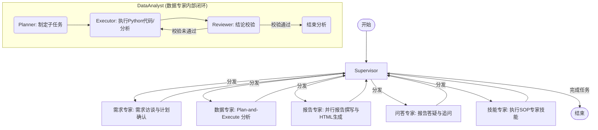

# 📊 Datation - 自动数据分析智能体

<p align="center">
  <a href="README.md">English</a> | <a href="README_zh.md">简体中文</a>
</p>

---

[](https://github.com/aning35/datation/releases)
[](https://www.python.org/downloads/)
[](https://nodejs.org/)
[](LICENSE)
[](https://github.com/aning35/datation/pulls)

**Datation** 是一个基于 **Multi-Agent Orchestration (多智能体编排)** 架构的深度数据分析系统。它利用 **LangGraph** 作为核心调度引擎，集成了 **MCP (Model Context Protocol)**、**Agent Skills (智能体技能库)**、以及 **Docling** 高级文档解析能力，能够处理从需求模糊调研到输出专业可视化分析报告的全流程任务。

项目提供了现代化、全响应式的 Web 控制台，具备精致的微交互与流畅的全局状态追踪，为用户带来极致的数据分析与智能体调试体验。

> 📸 **视觉展示**: 欢迎访问完整的 [功能与界面截图画廊](docs/screenshots_zh.md) 直观浏览工作区各项功能！

---

### 🚀 核心特性

#### 🎭 1. 多智能体协同架构 (Multi-Agent System)
系统采用 **Supervisor-Workers** 架构进行精密分工：
- **Supervisor (决策编排者)**: 核心 Orchestrator，负责全局路由、用户意图识别与任务分发。
- **RequirementsAnalyst (需求专家)**: 负责模糊需求调研与访谈，支持多轮 Clarification 与计划确认。
- **DataAnalyst (数据专家)**: 采用 **Plan-and-Execute (规划与执行)** 模式，自带安全的 **Python 计算沙箱**，支持深度数据挖掘与图表绘制，并引入 **Reviewer (审查者)** 机制，确保每一个结论都有数据支撑。
- **ReportGenerator (报告专家)**: 分章节并行撰写，支持智能去重，自动整合图表及分析结论，产出精美的高级 HTML 分析报告。
- **QAAgent (问答助手)**: 针对已分析成果和生成报告提供即时的追问与疑点解答，同时充当行政小助手管理用户的长期偏好记忆。
- **SkillExecutor (SOP/技能执行专家)**: 动态解析并严格执行符合 Agent Skills 标准的 Markdown 专家技能卡片（`SKILL.md`）。

#### 🧠 2. 深度推理与自修复 (Deep Reasoning & Self-Correction)
- **闭环诊断**: 代码执行失败时触发闭环诊断并自动寻求备用策略（如重试、换用算法、修正数据格式）。
- **审查校验**: 强制执行 Reviewer 机制，对生成的代码与中间结论进行多轮交叉验证。
- **思考模式一键切换**: 原生支持 DeepSeek V4 等深度推理模型。前端提供 `enable_thinking` 开关，可在“极速分析”与“深度思考”模式之间无缝切换，并在界面中呈现完整的 `<thinking>` 思维链。

#### 🛠️ 3. 丰富的底层工具链 (Rich Toolchain)
- **Data Computation**: 隔离的 Python 沙箱环境，预装 `pandas`、`numpy`、`matplotlib`、`openpyxl` 等分析库。
- **Local File Writer**: 安全可控的本地文件写入工具 `local_file_writer`，将高价值的 Markdown 报告和清洗后的 CSV/JSON 数据保存至 `./outputs` 安全归档，杜绝沙箱越界。
- **Shell Executor**: 提供安全可控的终端命令执行能力。
- **Web & Knowledge Search**: 整合网络搜索引擎与本地知识库检索能力。
- **Memory System**: 独创双重记忆系统。包含长期记忆偏好 (`user_preferences.json`，由 QA 智能体维护) 与会话经验沉淀 (`session_memory.jsonl`，自动记录代码报错修复轨迹)，确保智能体在对话中“吃一堑长一智”。

#### 🗂️ 4. 高保真文档处理 (High-Fidelity Parsing)
- 集成 **Docling** 引擎，支持 PDF、Excel、Word、PPTX、HTML 等多种格式的深度解析与高保真表格还原。

#### 🔌 5. 开放生态与零配置启动 (Zero-Config Demo)
- **MCP (Model Context Protocol)**: 原生支持加载外部 MCP Servers，无缝挂载自定义工具库或数据库，无限扩展智能体能力边界。
- **零配置开箱即用**: 首次启动时，Datation 会在用户主目录下自动生成一个 SQLite 演练数据库 (`~/.datation/demo_data.db`)，其中预装了仿真电商订单数据（包含 20 个核心客户、12 个商品分类、24 款热销单品、200+ 笔电商订单和 ~381 条明细）。系统将自动配置并使用 `uvx` 自动拉起 MCP SQLite 挂载此数据库。
- **Agent Skills**: 支持通过 Markdown 定义并动态加载领域专家 SOP 技能库 (`SKILL.md`)。
- **LLM 多平台支持**: 通过 LiteLLM 支持 DeepSeek、OpenAI、OpenRouter 等任意提供 OpenAI 兼容 API 的模型。

#### 🖥️ 6. 极致的前端交互体验 (Premium UX)
- **可视化文件浏览器**: 设置面板内置可视化目录选择器，直观选择本地数据库或工作区目录。
- **技能卡片市场**: 内置 Agent Skills 社区市场，支持一键拉取并安装远程 GitHub 仓库中的 Markdown 技能。
- **智能分析推荐**: 独创智能文件上传反馈，一键上传任何数据文件，基于 `suggestions/from-file` API 瞬间为用户生成 3 条极具洞察力的定制分析方向。
- **无损会话回滚**: 允许用户对对话树中的任意历史消息进行一键回滚。系统后台将自动截断 LangGraph 状态、裁切 SSE 流日志 `stream_logs.jsonl`（自动保存 `.bak.N` 顺序备份）、重置 Supervisor 路由状态并清理活动计划。
- **全局搜索 (⌘K)**: 精美的命令行和侧边栏全局检索，秒级切换会话与指令。
- **智能体 Token 看板**: 实时展示 Supervisor、DataAnalyst、ReportGenerator 等各智能体节点的 Token 消耗明细与估算成本。
- **实时日志流面板**: 独立的开发者日志面板，流式呈现 SQL 执行、Python 计算及 LLM 原生报文。
- **人机协同确认关卡**: 当智能体执行写入高价值文件或敏感 Shell 命令时，前端提供交互式安全确认门闸。
- **一键热重启**: 支持在设置中一键重启后台服务，包含优雅的国际化通知、120 秒高容错健康检测轮询与状态自动恢复。
- **斜杠命令与上下文 `@` 提及**: 在输入框中输入 `/` 触发快捷命令，或输入 `@` 引入当前工作区的上下文（文件、对话）。自带精美的行内交互提示栏。

#### 💻 7. 跨平台桌面端应用 (Electron App)
- **智能环境检测 (Smart Environment Detection)**: 启动时自动从系统 PATH (涵盖 Homebrew、Miniconda、Cargo 等常见路径) 检测依赖项 `uv` 和 `Python`。
- **交互式安装向导 (Setup Wizard)**: 当检测到缺失环境时，弹出精美的安装与配置引导卡片：
  - 各环境的实时 ✅/❌ 检测状态。
  - 支持一键切换 **China Mirror (国内镜像源)** 和官方源，智能解决网络下载问题。
  - 支持 **极客自选模式**: 提供 `[Browse/选择本地]` 链接，允许用户手动在文件系统里选择 `uv` 所在的自定义目录。
- **无感快启通道 (Zero-Friction Fast Path)**: 如果所有环境都已就绪，桌面端启动时将**完全跳过向导**，只需不到一秒即可直接无缝进入后端启动流程。
- **配置持久化记忆**: 用户选择的自定义路径会自动存储至本地的 `datation-env.json`，实现“一次配置，永久免打扰”。

---

### 📐 系统架构与工作流



---

### 📂 工程目录结构

```text
datation/
├── datation/                # Python 后端核心代码
│   ├── agents/              # 智能体核心定义 (Supervisor, Workers, Prompts)
│   ├── api/                 # FastAPI 路由、SSE 消息流、智能推荐及回滚
│   ├── core/                # 全局配置管理、状态定义与思考模型包装
│   ├── locales/             # 后端多语言国际化文件 (zh.json, en.json)
│   ├── utils/               # 通用工具类与文档处理器 (Docling)
│   ├── main.py              # 服务端启动入口，注册 Tools 与 API
│   ├── mcp_client.py        # MCP Server 的管理与连接逻辑
│   └── skill_loader.py      # Agent Skills 加载器
├── frontend/                # 前端代码
│   ├── src/components/      # UI 组件 (Chat, Plan, Files, Settings, Logs, Workflow, Search, Token)
│   ├── src/i18n/            # 前端多语言国际化支持
│   ├── package.json         # 前端依赖配置 (React 19, Tailwind v4, Monaco Editor, Framer Motion)
│   └── vite.config.ts       # Vite 配置文件
├── scripts/                 # 自动化与环境配置脚本
│   ├── seed_data.sql        # 标准 PostgreSQL 种子 SQL
│   ├── seed_demo_db.py      # SQLite 仿真电商数据库生成器
│   ├── setup_cn.sh          # macOS/Linux 中国网络环境一键安装脚本
│   └── setup_cn.bat         # Windows 中国网络环境一键安装脚本
├── skills/                  # 符合 AgentSkills 标准的专业 SOP 目录
├── tools/                   # 底层执行工具
│   ├── data_computation/    # 隔离的 Python 计算沙箱
│   ├── knowledge_search/    # 本地知识库向量检索引擎
│   ├── local_file_reader/   # 安全文档读取工具
│   ├── local_file_writer/   # 安全本地报告写入工具
│   ├── memory/              # 双重记忆系统 (长期偏好与会话经验沉淀)
│   ├── shell_executor/      # 可控终端命令执行器
│   └── web_search/          # 网络搜索服务集成
├── desktop/                 # 跨平台桌面端 (Electron)
│   ├── main.js              # 主进程逻辑 (环境检测、后端生命周期、IPC通讯)
│   ├── preload.js           # 安全桥接脚本
│   ├── splash.html          # 多阶段启动向导 UI (检测 → 配置 → 安装 → 启动)
│   └── resources/           # 桌面端各平台应用图标
├── tests/                   # 自动化测试用例
├── start.sh                 # macOS/Linux 一键启动脚本
├── start.bat                # Windows 一键启动脚本
├── start.py                 # 跨平台启动脚本 (Python)
├── pyproject.toml           # uv 包依赖管理
└── uv.lock                  # Python 依赖锁定文件
```

---

### 🛠️ 快速开始

#### 0. 下载桌面端应用 (最推荐)
为了获得最丝滑的开箱即用体验，我们强烈建议您直接下载预编译好的 **Datation 桌面端应用** (提供 Windows `.exe`, macOS `.dmg`, Linux `.AppImage` 格式)。
👉 **[点击这里前往 Release 页面下载最新版本](https://github.com/aning35/datation/releases/latest)**

桌面端应用自带环境检测与自动配置向导，帮您省去所有繁琐的终端命令步骤！

#### 1. 环境准备 (面向开发者/源码运行)
确保您的系统已安装 `Python 3.12+` 和 `Node.js 20+`。

我们强烈推荐使用高效率的 [uv](https://github.com/astral-sh/uv) 管理 Python 环境与依赖：
```bash
# macOS / Linux 安装 uv
curl -LsSf https://astral-sh/uv/install.sh | sh
```

#### 2. 初始化配置
1. 复制环境变量配置文件：
   ```bash
   cp .env.example .env
   ```
2. 系统支持通过全局配置文件 `~/.datation/config/app.json` 或 Web 界面的 **Settings** 面板进行可视化配置。
3. 请配置您的 `LLM_API_KEY` and `LLM_API_BASE`。例如使用 DeepSeek 平台：
   ```json
   {
     "llm_model": "deepseek-v4-pro",
     "llm_api_base": "https://api.deepseek.com",
     "llm_api_key": "your_api_key_here"
   }
   ```

> [!TIP]
> **零门槛演练**: 首次启动时，系统会自动在主目录下生成仿真的 SQLite 数据库 (`demo_data.db`)，并通过默认的 SQLite MCP 挂载。您无需配置任何外部数据库，只需配置大模型 Key，即可马上提问如“分析一下 2024 年的商品销售趋势”，瞬间体验全自动数据分析！

#### 3. 一键启动
项目根目录下提供了开发环境一键启动脚本，可同时拉起 FastAPI 后端与 React 前端：
```bash
# macOS / Linux
chmod +x start.sh
./start.sh

# Windows
start.bat

# 或者使用跨平台 Python 脚本
python start.py
```

启动成功后：
- 🌟 **Web 控制台**: [http://localhost:1420](http://localhost:1420)
- 📡 **后端 API**: [http://localhost:18321](http://localhost:18321)

#### 🇨🇳 中国大陆网络环境一键安装
如果因国内网络问题拉取 `pypi` 依赖或 `npm` 依赖缓慢，我们为您提供了极速安装脚本。它会自动检测并安装 Python 3.12+、uv、Node.js 20+，并**全局配置国内镜像源**（Python 使用清华大学源，Node.js 使用淘宝镜像源）：
```bash
# macOS / Linux
chmod +x scripts/setup_cn.sh
./scripts/setup_cn.sh

# Windows (Command Prompt)
scripts\setup_cn.bat
```
安装完成后，直接在根目录运行 `./start.sh` 或 `start.bat` 即可！
