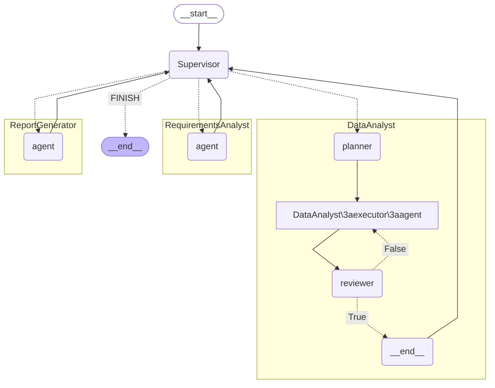

```mermaid
---
config:
  flowchart:
    curve: linear
---
graph TD;
	__start__([<p>__start__</p>]):::first
	Supervisor(Supervisor)
	__end__([<p>__end__</p>]):::last
	DataAnalyst\3a__end__ --> Supervisor;
	ReportGenerator\3aagent --> Supervisor;
	RequirementsAnalyst\3aagent --> Supervisor;
	Supervisor -.-> DataAnalyst\3aplanner;
	Supervisor -.-> ReportGenerator\3aagent;
	Supervisor -.-> RequirementsAnalyst\3aagent;
	Supervisor -. &nbsp;FINISH&nbsp; .-> __end__;
	__start__ --> Supervisor;
	subgraph DataAnalyst
	DataAnalyst\3aplanner(planner)
	DataAnalyst\3areviewer(reviewer)
	DataAnalyst\3a__end__(<p>__end__</p>)
	DataAnalyst\3aexecutor\3aagent --> DataAnalyst\3areviewer;
	DataAnalyst\3aplanner --> DataAnalyst\3aexecutor\3aagent;
	DataAnalyst\3areviewer -. &nbsp;True&nbsp; .-> DataAnalyst\3a__end__;
	DataAnalyst\3areviewer -. &nbsp;False&nbsp; .-> DataAnalyst\3aexecutor\3aagent;
	end
	subgraph RequirementsAnalyst
	RequirementsAnalyst\3aagent(agent)
	end
	subgraph ReportGenerator
	ReportGenerator\3aagent(agent)
	end
	classDef default fill:#f2f0ff,line-height:1.2
	classDef first fill-opacity:0
	classDef last fill:#bfb6fc

```