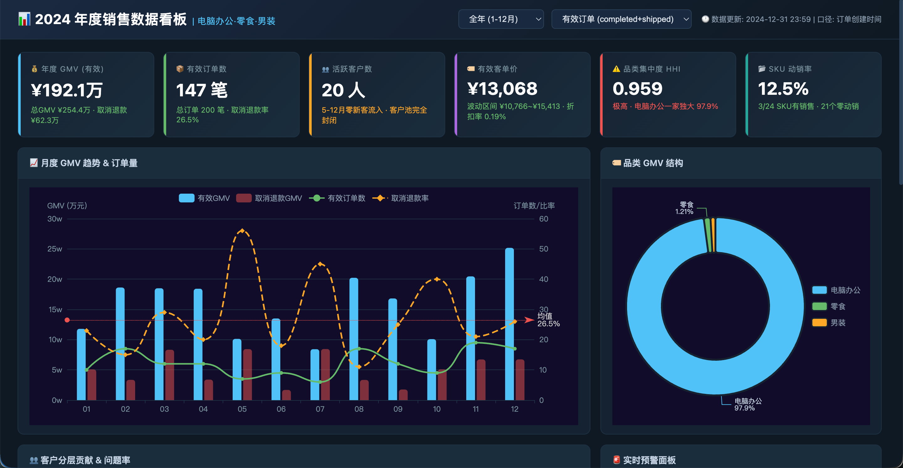

# 📸 Datation Feature & UI Gallery

  <a href="screenshots.md">English</a> | <a href="screenshots_zh.md">简体中文</a>

Welcome to the Datation Visual Gallery. Below is a highly accurate, slide-by-slide walkthrough of the 16 screenshot captures from the Datation multi-agent workspace.

---

### 01. Agent Trace Dashboard
The core interface of the Chat session displaying live execution traces. The Supervisor decides to route to `DataAnalyst` to analyze `Pokemon.csv`. The `Planner` lays out the tasks checklist, while the `Executor` reads the file and returns a structured markdown summary of the dataset.

---

### 02. Agent Workflow Interactive Graph
The visual topology diagram mapping the cooperative relationship of the LangGraph multi-agent network. It highlights the main orchestrator (`Supervisor`) and subgraphs representing worker agents (`SkillExecutor`, `QAAgent`, `ReportGenerator`, `RequirementsAnalyst`, and `DataAnalyst` with its nested ReAct loops).

---

### 03. Plan Checklist View
A detailed breakdown of the task execution plan, displaying a 100% completed progress bar and a step-by-step checklist. Completed operations include loading skills, reading the file schema, executing computation in the sandbox, and compiling the final markdown analysis chapter.

---

### 04. Session File Manager & Image Preview
The workspace's file explorer showing structured generation directories (from `run_1` to `run_8`). Under `run_8`, a generated distribution chart `generation_analysis.png` is highlighted and rendered in the premium side preview panel, showcasing the distribution of weak Pokemon.

---

### 05. Multi-Agent Token Tracker
A granular token consumption budget dashboard. It highlights total Input/Output token statistics, LLM call counts, and a percentage breakdown grouped by agent components (Executor 73.5%, Generate_Chapter 12.1%, Reviewer 6.8%, Supervisor 3.7%, Planner 2.2%, etc.).

---

### 06. Renders & Live Streaming Logs Panel
On the left, a beautifully rendered HTML analytical report displaying statistical charts and structured summaries. On the right, the drawer is opened to show real-time stream logs containing the raw JSON payloads of LLM prompt calls and completion results.

---

### 07. LLM Model System Configuration
The settings overlay under the "Model" tab. Users can configure the execution target model (e.g. `deepseek-v4-pro`), API endpoint bases, keys, temperature parameters, max token constraints, and toggle full API traffic debugging.

---

### 08. Custom MCP Server Config Monaco Editor
The settings panel under the "MCP" tab. An integrated Monaco Code Editor allows developers to configure custom databases (e.g. mounting a PostgreSQL MCP server using `npx -y @modelcontextprotocol/server-postgres`) via a clean JSON config.

---

### 09. Skills Management Dashboard
The settings view under the "Skills" tab. It lists scanned skills cards under `~/.datation/skills` (e.g. `ui-ux-pro-max`, `markdown-to-html`, `contract-review`, `find-skills`) ready to inject expert SOP instructions into the execution loop.

---

### 10. Community Skill Marketplace
A community marketplace displaying millions of available expert skills (e.g., `autoreview`, `channel-message-flows`, `clawdtributor` by `openclaw`). It provides a search console, multi-level category navigation, star counts, and one-click install buttons.

---

### 11. General Application Settings
The display configurations view. Users can configure permanent database targets (e.g., PostgreSQL DB connection URIs), enable LangSmith agent tracing, and switch display languages via simple dropdown menus.

---

### 12. SkillExecutor PPTX Generation Output Trace
A real-world trace in the chat history showing `SkillExecutor` successfully executing a specialized presentation SOP. It outputs a `.pptx` slide deck and its corresponding page-by-page `.svg` source graphics saved under `outputs/`.

---

### 13. SkillExecutor Edge-TTS Audio Generation Trace
An trace showcasing the `SkillExecutor` utilizing a custom text-to-speech SOP card (`@sundial-org-edge-tts`). It successfully synthesizes the analytical conclusions into an audio file saved at `outputs/pokemon_analysis_tts.mp3` for voice playback.

---

### 14. Command Autocomplete / Shortcut Menu
The chat box autocomplete popover triggered when typing `/` in the input field, allowing users to direct commands and mention specific workers (Supervisor, Requirements Analyst, Data Analyst, Report Generator, QA Agent, Skill Executor).

---

### 15. File & Skill Autocomplete / Shortcut Menu
The chat box autocomplete popup triggered when typing `@` in the input field, enabling users to mention uploaded files or reference specialized skills dynamically in conversational prompts.

---

### 16. Interactive Data Dashboard (HTML)
A fully interactive, standalone HTML data dashboard generated by the `dashboard-design` Agent Skill. Features dark-themed ECharts visualizations including monthly GMV trend charts, category donut breakdowns, customer segmentation panels, and real-time alert modules — all with working tab navigation, dropdown filters, and responsive layout.

