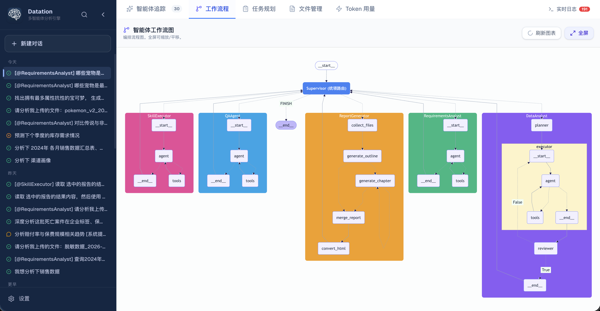
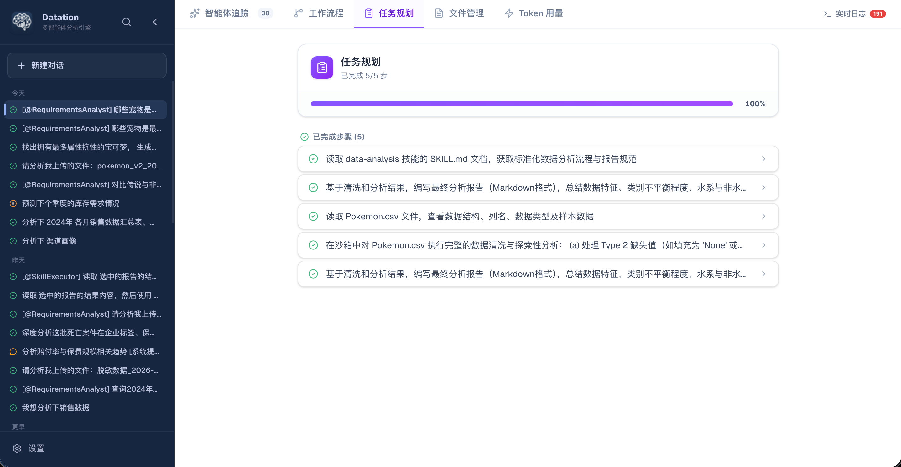
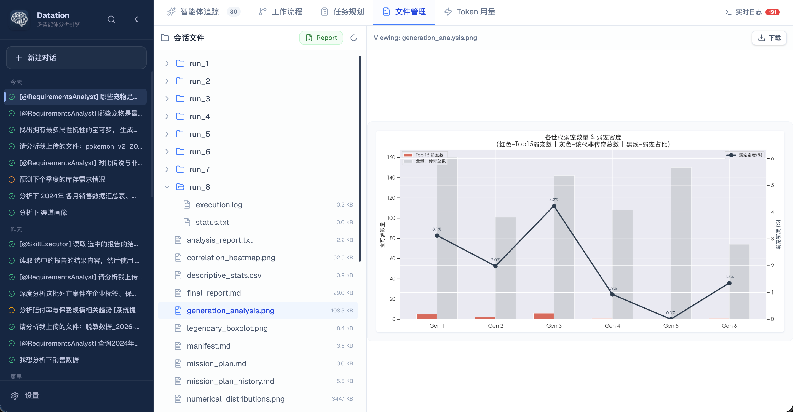
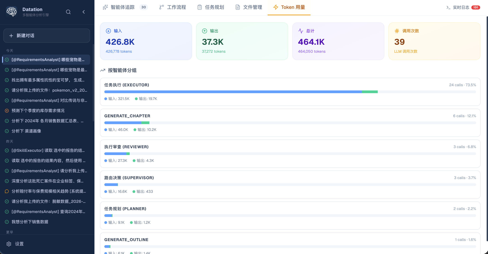
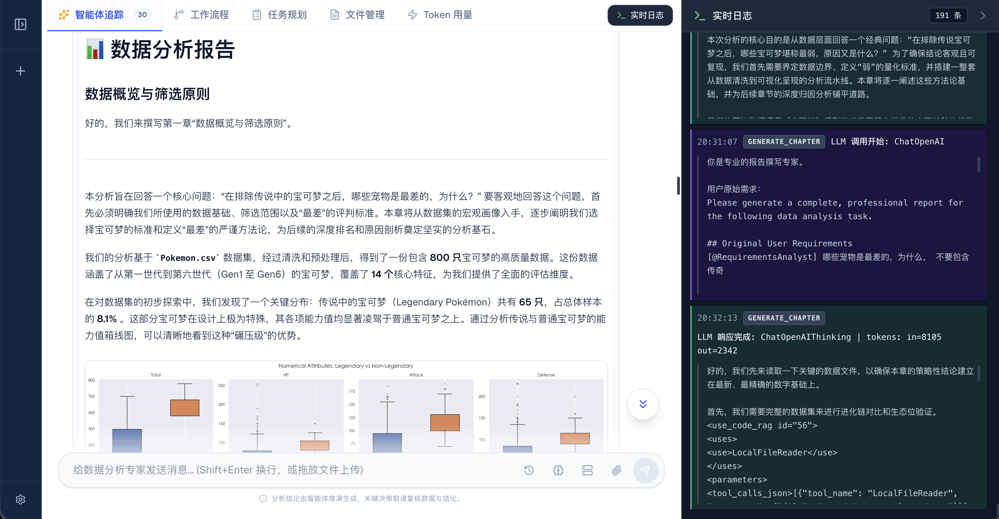
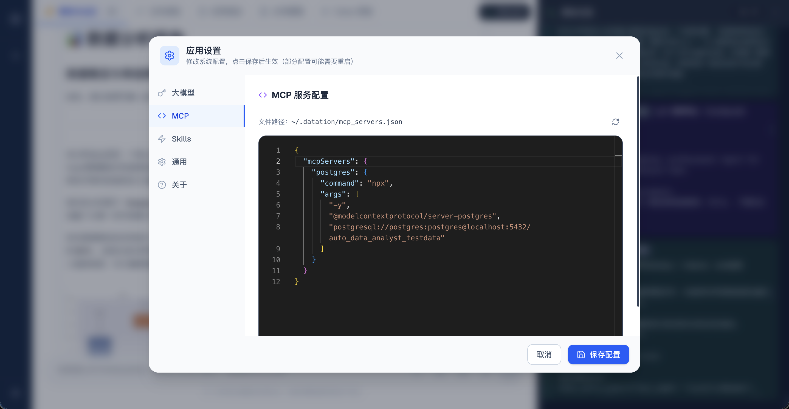
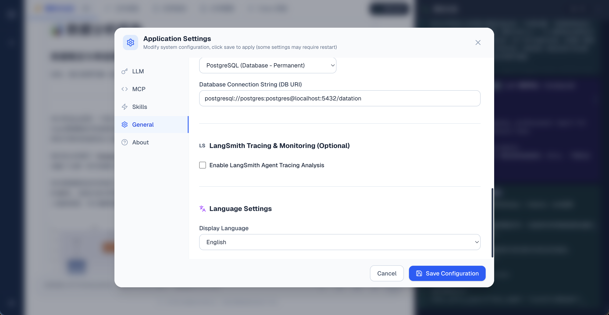
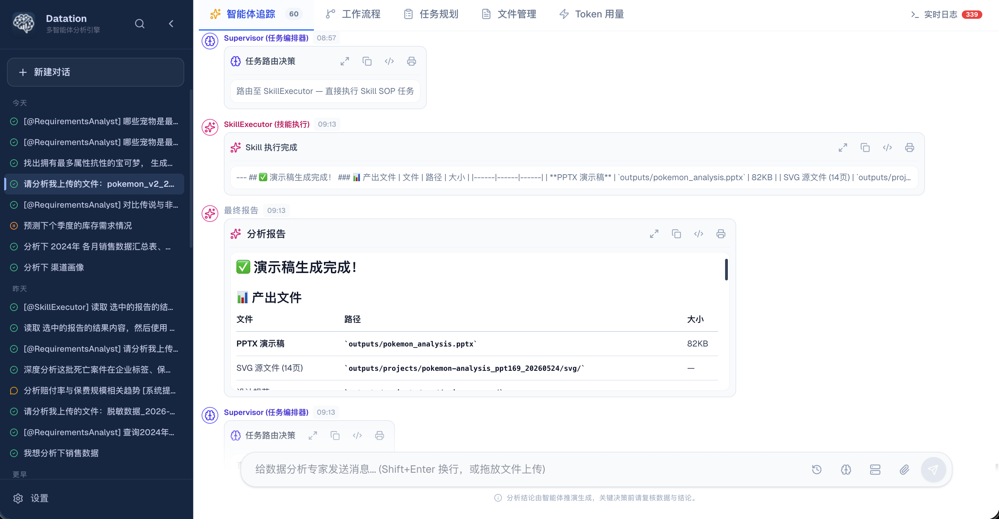
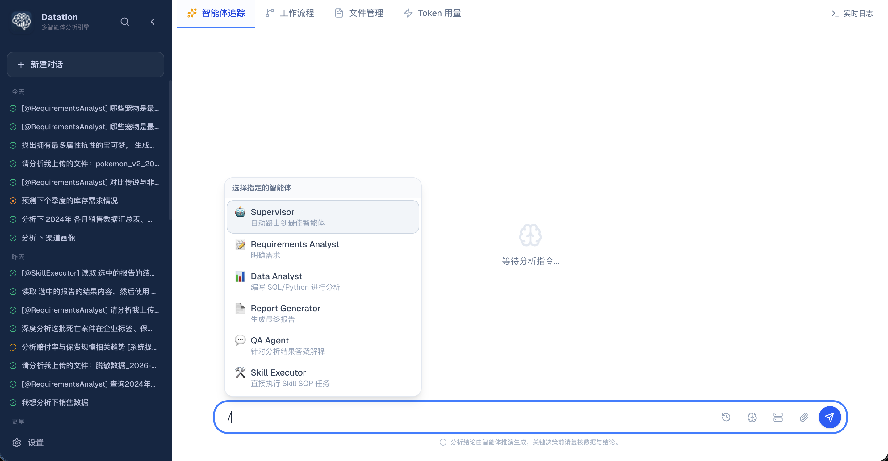

# 📸 Datation 功能与界面展示

  <a href="screenshots.md">English</a> | <a href="screenshots_zh.md">简体中文</a>

欢迎来到 Datation 视觉画廊。以下是经过精确解析的 15 张系统实机截图，为您生动展现 Datation 多智能体分析控制台的各项核心功能。

---

### 01. 智能体追踪 (Agent Trace) 主控制面板
会话执行的追踪视图。图中 Supervisor 统领路由决策将任务分配给数据专家 `DataAnalyst`；规划专家 `Planner` 制定子任务清单；执行器 `Executor` 读取宝可梦数据集并给出格式化的表格结构元数据预览。

---

### 02. 多智能体工作流程可视化拓扑图
图形化展示基于 LangGraph 编排的智能体协同网络。清晰展现了核心决策编排器 (`Supervisor`)、退出终点节点 (`__end__`)，以及包含嵌套计算审查的子工作图（需求专家、数据专家、报告专家、问答助手以及技能执行器）。

---

### 03. 任务规划 (Plan) 甘特图与步骤检查单
详细的子步骤进度追踪，呈现 100% 满格进度条。已完成的 5 大步骤均标记了绿色的勾选状态，包含了标准 SOP 文档扫描、数据读取、沙箱数据清洗、图表绘制以及最终报告的自动整合编译。

---

### 04. 会话文件管理器与图表大图预览
可视化文件资源管理器。左侧呈现 `run_1` 到 `run_8` 会话生成的目录树结构；右侧高级预览面板渲染了当前选中的 `generation_analysis.png` 箱线直方图（用于直观对比各世代弱小宠物的分布密度）。

---

### 05. 多智能体 Token 预算消耗看板
Token 消耗多维度统计面板。顶部醒目统计出输入/输出/总计 Token 与大模型调用次数；下方通过可视化进度条展现各智能体所占比例（数据执行 73.5%、章节撰写 12.1%、结果审查 6.8%、路由决策 3.7% 等）。

---

### 06. 可视化 HTML 报告与实时开发者日志
左侧展示生成的包含交互式数据图表的 HTML 数据分析报告，右侧拉出流式开发者日志面板，提供大模型 prompt 调用报文与 token 参数的秒级还原跟踪。

---

### 07. 大模型高级运行参数设置
系统设置中的“大模型”配置面板。用户可直观配置使用的模型名称（如 `deepseek-v4-pro`）、API Base 地址、API Key、模型温度、最大生成 Token 限制，并可一键开启 AI 报文调试输出。

---

### 08. 挂载自定义 MCP 服务的 Monaco 编辑器
系统设置中的“MCP”配置面板。内置了 Monaco Code Editor，允许开发者以标准的 JSON 语法快速配置与编写挂载外部数据库（如通过 postgresql 协议连接至本地数据库）的 MCP 协议描述。

---

### 09. 技能扫描与专家 SOP 技能管理
系统设置中的“Skills”配置面板。系统自动扫描 `~/.datation/skills` 目录下的可用技能包，展示了已装载的 `ui-ux-pro-max`、`markdown-to-html`、`contract-review`、`find-skills` 等 11 个专业标准操作卡片。

---

### 10. 智能体社区技能市场
技能市场详情卡片库。展示了海量可用技能，左侧提供树形大类筛选导航，右侧卡片显示了技能评分、分支数据以及一键安装到本地目录的安装交互。

---

### 11. 系统通用与多语言设置
英文界面下的通用设置面板。用户可指定数据存储的永久数据库连接串（如 postgresql 实例）、一键启用 LangSmith 智能体追踪链、并通过下拉菜单在英/中文本展示中平滑切换。

---

### 12. SkillExecutor 幻灯片演示稿自动生成痕迹
聊天记录中呈现技能执行器 (`SkillExecutor`) 按照预定 SOP 执行任务的运行痕迹。读取并分析宝可梦数据后，在 `outputs/` 下自动生成了完好的 `.pptx` 汇报演示文稿及 SVG 分页设计图纸。

---

### 13. SkillExecutor 语音合成 (Edge-TTS) 运行痕迹
技能执行器读取分析结论后，调用外部 TTS 标准音频转换技能（`@sundial-org-edge-tts`），成功将复杂的文本报告自动转化为音频流，文件直接存盘为 `pokemon_analysis_tts.mp3`。

---

### 14. 智能体快捷命令提示菜单 (`/` 键补全)
在会话聊天输入框输入 `/` 时弹出的快捷补全悬浮面板，支持用户一键呼叫和强行指定下层 Workers 智能体（如 Supervisor, Requirements Analyst, Data Analyst, Report Generator 等）接管当前对话。

---

### 15. 会话文件与技能快捷提及菜单 (`@` 键补全)
在会话聊天输入框输入 `@` 时触发的自动联想提示。支持在输入问题时快速提及之前上传过的表格文件，或是直接引用已安装的专家 SOP 技能包（如交互设计、合同审查等）。

