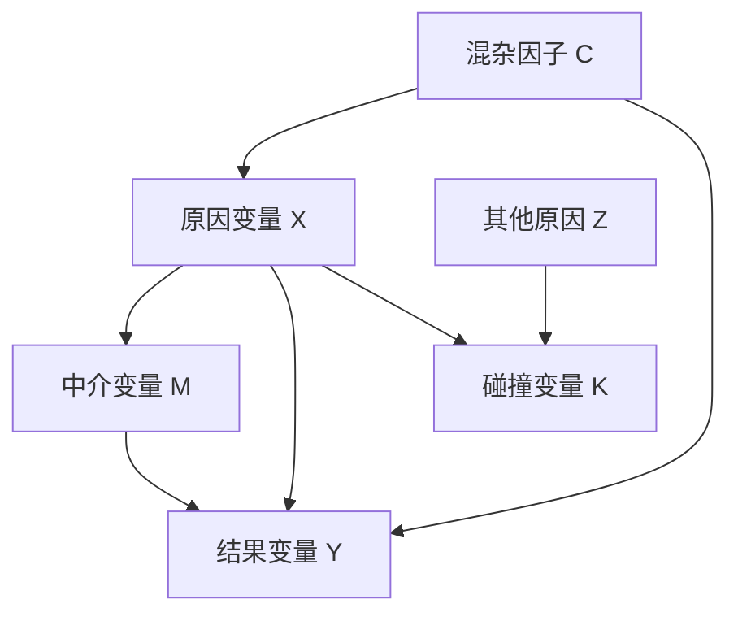
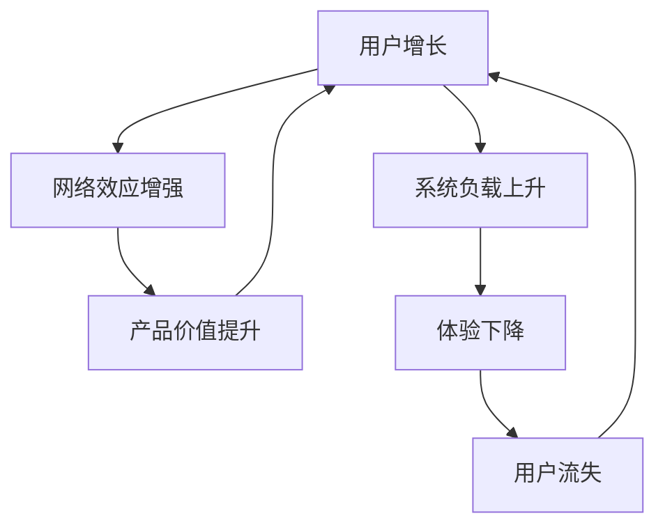

# 深度因果归因与本质探究标准作业程序  
# Deep Causal Analysis & Root Cause SOP

本技能用于规范智能体如何对复杂系统、业务指标、历史事件、社会现象、组织问题或自然现象进行深度因果归因与本质机制推导。

其核心目标不是简单回答“可能是因为 X”，而是通过竞争性假设、因果图、证据矩阵、反事实推理和过程追踪，逐步判断：

- 现象是否真实存在；
- 哪些因素只是相关；
- 哪些因素可能构成因果；
- 哪些因素是根因、近因、触发因子或放大器；
- 哪些结论证据强，哪些只是待验证假设；
- 哪些节点最值得干预。

核心原则：

> 不把相关性误判为因果。  
> 不在证据不足时强行下定论。  
> 不为了显得严谨而虚构数据、时间线或统计结论。  
> 不追求单一答案，而是追求更接近事实的因果结构。

---

# 一、适用场景

## 1. 适合使用本技能的场景

当用户的问题属于以下类型时，应使用本技能：

- 追问复杂现象背后的“为什么”；
- 需要分析业务指标上涨、下跌、异常波动的原因；
- 需要复盘某个项目失败、组织问题、事故、风险事件或市场变化；
- 需要区分主因、次因、触发因子、结构因子、放大器；
- 需要判断多个因素之间是否存在因果关系；
- 需要构建底层机制、演化路径或系统动力学解释；
- 需要形成干预策略，而不是只描述现象；
- 需要识别高杠杆节点，找到“四两拨千斤”的关键变量。

## 2. 不适合使用本技能的场景

以下场景不应强行使用本技能：

- 用户只需要简单事实查询；
- 用户只需要摘要、改写、翻译或格式整理；
- 问题是明确的技术故障排查，直接定位即可；
- 用户只需要快速头脑风暴，不要求严谨归因；
- 用户明确只想要相关性描述，而不需要因果推断；
- 信息极少且用户不希望展开深度分析。

---

# 二、核心输出要求

使用本技能时，最终输出应尽量包含：

1. 现象界定；
2. 证据条件评估；
3. 竞争性假设；
4. 因果图；
5. 变量角色识别；
6. 证据-假设矩阵；
7. 机制链条；
8. 反事实分析；
9. INUS 条件判断；
10. 归因结论；
11. 高杠杆干预点；
12. 局限性与待验证事项。

若用户只需要简版分析，可以压缩结构，但不得省略以下三项：

- 竞争性假设；
- 证据强度；
- 局限性声明。

---

# 三、核心工作流

## 0. 证据与识别条件评估  
## Evidence & Identification Assessment

在正式归因之前，必须先判断当前证据条件。不同证据条件只能支持不同强度的因果结论。

### 0.1 需要先判断的问题

- 是否有原始数据？
- 是否有时间序列？
- 是否有干预前后对比？
- 是否有对照组？
- 是否存在随机分配？
- 是否存在自然实验或外生冲击？
- 是否有足够样本量？
- 是否存在统计口径变化？
- 是否可能只是数据质量问题？
- 是否只是访谈、会议纪要、新闻、个案材料或历史叙事？
- 当前最多能支持什么级别的因果判断？

### 0.2 证据条件与结论强度

| 证据条件 | 可支持的结论强度 |
| :--- | :--- |
| RCT / A/B 实验 | 较强因果识别 |
| 准实验 / DID / RDD / IV | 中强因果识别，但依赖识别假设 |
| 面板数据 / 时间序列 | 中等因果推断 |
| 截面观察数据 | 较弱因果推断，容易受混杂影响 |
| 个案材料 / 访谈 / 历史叙事 | 机制解释或假设生成 |
| 信息严重不足 | 只能提出待验证假设 |

### 0.3 必须声明

在分析开头必须声明：

- 当前可用证据是什么；
- 当前缺失证据是什么；
- 当前最多能支持什么级别的结论；
- 当前不能支持什么级别的结论。

示例：

> 当前证据主要来自会议纪要和业务描述，缺少原始时间序列数据、对照组和样本明细。因此，本分析最多支持“机制性归因”和“待验证假设排序”，不能直接得出强因果结论。

---

## 1. 现象界定  
## Phenomenon Definition

在归因之前，必须先把“要解释的结果”定义清楚。

### 1.1 精准界定结果变量

需要明确：

- 需要解释的结果 Y 是什么；
- 发生在什么时间段；
- 影响了哪些对象、群体、区域、渠道或系统；
- 变化幅度多大；
- 相对哪个基准线发生变化；
- 是一次性变化，还是持续性变化；
- 是否明显超出历史正常波动区间；
- 是否可能是数据采集、统计口径或样本结构变化造成的假象。

### 1.2 业务指标异动场景的 Measurement Check

如果分析对象是业务指标异动，必须先检查：

- 指标定义是否变化；
- 埋点或采集逻辑是否变化；
- 统计口径是否变化；
- 样本过滤规则是否变化；
- 是否存在数据延迟；
- 是否存在重复计算或漏算；
- 是否存在异常值；
- 是否存在季节性、节假日、周期性因素；
- 是否只是随机波动；
- 是否存在渠道结构、用户结构或产品结构变化。

原则：

> 先确认这是“真实业务变化”，再进入因果归因。  
> 不得把数据口径问题误判为业务根因。

---

## 2. 竞争性假设构建  
## Competing Hypotheses

### 2.1 构建多个竞争性假设

默认构建 3 到 5 个竞争性假设。假设必须来自具体领域知识，不得机械套用模板。

假设可以来自以下层级：

- 外部环境因素；
- 政策或市场变化；
- 内部策略变化；
- 产品机制变化；
- 用户结构变化；
- 渠道结构变化；
- 组织激励变化；
- 资源配置变化；
- 技术系统变化；
- 数据口径变化；
- 反馈循环；
- 随机波动或噪声。

### 2.2 假设之间不必互斥

复杂现象往往不是单因单果，而是多个因素共同作用。

必须警惕：

- 多重因果性；
- 殊途同归；
- 结构因子与触发因子叠加；
- 反馈循环放大；
- 同一个结果由多条独立路径造成。

不得为了追求“唯一答案”而强行保留一个假设、淘汰其他假设。

### 2.3 假设表达要求

每个假设都应该表达为清晰的因果命题：

错误示例：

> 可能是市场问题。

正确示例：

> 假说 A：由于同期竞争对手加大补贴，目标用户的价格敏感度被激活，导致用户从本平台迁移到竞品，最终造成订单转化率下降。

---

## 3. 因果图建模  
## Causal Graph Modeling

### 3.1 根据问题类型选择图模型

不得机械地把所有问题都画成同一种图。

- 如果目标是识别某个变量对结果的因果效应，应优先使用 DAG。
- 如果目标是解释系统长期演化、反馈循环、震荡、路径依赖或崩溃，应使用 Causal Loop Diagram。
- 如果存在反馈环，不得强行使用 DAG。
- 如果使用 DAG，图中不得出现闭环。

### 3.2 DAG 适用场景

DAG 适合回答：

- X 是否导致 Y；
- 哪些变量是混杂因子；
- 哪些变量应该控制；
- 哪些变量不应该控制；
- 如何避免碰撞变量偏差；
- 如何区分中介变量和混杂变量。

### 3.3 因果环图适用场景

Causal Loop Diagram 适合回答：

- 系统为什么越滚越大；
- 为什么小变化引发大后果；
- 为什么干预后出现反弹；
- 为什么长期积累后突然崩溃；
- 正反馈和负反馈如何共同作用；
- 延迟效应如何导致误判。

### 3.4 图表输出要求

当问题存在多个变量、混杂、中介、反馈或路径依赖时，必须使用 Mermaid 呈现因果结构。

示例 DAG：

示例因果环图：

---

## 4. 变量角色识别

## Variable Role Classification

在控制变量或判断因果方向之前，必须先识别变量角色。

### 4.1 常见变量角色

| 变量类型  | 含义             | 是否应控制          |
| :---- | :------------- | :------------- |
| 原因变量  | 被怀疑影响结果的变量     | 关注对象           |
| 结果变量  | 需要解释的最终现象      | 不作为控制变量        |
| 混杂因子  | 同时影响原因和结果的共同原因 | 通常应控制          |
| 中介变量  | 原因影响结果的传导路径    | 取决于估计总效应还是直接效应 |
| 碰撞变量  | 同时受多个原因影响的变量   | 通常不得控制         |
| 后处理变量 | 原因发生之后才出现的变量   | 通常不得控制         |
| 选择变量  | 决定样本是否被观察到的变量  | 需高度警惕选择偏差      |
| 调节变量  | 改变因果强度或方向的变量   | 用于异质性分析        |
| 反馈变量  | 被结果反过来影响的变量    | 需用系统动力学处理      |

### 4.2 控制变量原则

不得机械控制所有相关变量。

原则：

* 混杂因子通常应控制；
* 碰撞变量不得控制；
* 中介变量是否控制取决于研究目标；
* 后处理变量通常不得控制；
* 选择变量需要谨慎处理；
* 控制变量必须基于因果图，而不是基于相关性大小。

---

## 5. 剥离混杂与方向性检验

## Confounding Control & Directionality

此阶段用于穿透表面相关性，判断真正的因果箭头。

### 5.1 混杂控制

可使用：

* 分层分析；
* 控制变量；
* 匹配方法；
* 固定效应；
* 双重差分；
* 工具变量；
* 断点回归；
* 倾向得分匹配；
* 因果森林；
* 过程追踪中的对照案例。

但必须注意：

> 方法选择取决于数据条件。不得在没有识别条件时强行使用高级方法。

### 5.2 时间前置性检验

原因必须发生在结果之前。

需要判断：

* X 是否早于 Y；
* X 的变化是否先于 Y 的变化；
* 是否有滞后效应；
* 是否存在同步变化但由共同原因造成；
* 是否存在 Y 反过来影响 X。

### 5.3 反向因果检验

必须警惕：

* 是 X 导致 Y，还是 Y 导致 X；
* 是两者互为因果，形成反馈；
* 是共同原因 C 同时导致 X 和 Y；
* 是选择机制让 X 和 Y 看起来相关。

### 5.4 反馈环识别

若存在反馈关系，需要识别：

* 初始触发条件；
* 正反馈循环；
* 负反馈循环；
* 延迟效应；
* 自我强化机制；
* 系统反弹机制；
* 阈值效应或临界点。

---

## 6. 证据-假设矩阵

## Evidence-Hypothesis Matrix

### 6.1 矩阵目的

证据矩阵的目的不是堆砌材料，而是判断每条证据对不同假设的区分能力。

必须区分：

* 支持；
* 反驳；
* 中性；
* 无法判断；
* 证据不足；
* 证据诊断力高低。

### 6.2 标准模板

| 关键证据/事实 | 假说 1         | 假说 2         | 假说 3         | 证据诊断力     | 当前判断         |
| :------ | :----------- | :----------- | :----------- | :-------- | :----------- |
| 证据 1    | 支持 / 反驳 / 中性 | 支持 / 反驳 / 中性 | 支持 / 反驳 / 中性 | 高 / 中 / 低 | 保留 / 降权 / 淘汰 |
| 证据 2    | ...          | ...          | ...          | ...       | ...          |

### 6.3 证据判断规则

* 支持不等于证明；
* 无关不等于反驳；
* 缺失证据不等于证伪；
* 单个证据很少能单独证明复杂因果；
* 高诊断力证据优先于普通背景证据；
* 若证据不足以淘汰假设，应保留多个解释并排序；
* 不得为了完成分析而强行淘汰假设。

### 6.4 假设淘汰原则

只有在出现明确反证时，才可以淘汰假设。

可淘汰的情况包括：

* 时间顺序不成立；
* 关键变量没有发生变化；
* 机制链条中断；
* 反事实对照明显不支持；
* 与高质量证据直接冲突；
* 该假设无法解释核心异质性。

若没有足够证据，应标注为：

* 暂时保留；
* 证据不足；
* 需要补充验证；
* 降低可信度但不淘汰。

---

## 7. 机制溯源与过程追踪

## Mechanism Tracing & Process Tracing

### 7.1 过程追踪目标

过程追踪不是把故事讲顺，而是寻找能够区分不同假说的诊断性证据。

需要回答：

* X 是如何一步步影响 Y 的；
* 中间经过了哪些机制节点；
* 每个节点是否有证据支撑；
* 哪个环节是推测，哪个环节有直接证据；
* 有没有关键证据能够排除其他解释。

### 7.2 机制链条要求

跨度过大的因果链不成立。

错误示例：

> 市场竞争加剧，所以用户流失。

正确示例：

> 竞争对手加大补贴
> → 价格敏感用户迁移
> → 本平台低客单价订单减少
> → 整体转化率下降
> → 复购用户占比下降
> → 月度 GMV 下滑。

### 7.3 诊断性证据示例

可用于过程追踪的证据包括：

* 决策记录；
* 版本上线记录；
* 政策变化时间点；
* 渠道投放变化；
* 用户行为变化；
* 销售漏斗变化；
* 组织激励变化；
* 访谈材料；
* 日志数据；
* 关键节点前后的指标变化；
* 同类案例对照。

---

## 8. 反事实推理

## Counterfactual Reasoning

### 8.1 核心问题

必须提出反事实问题：

> 如果没有变量 X，结果 Y 还会发生吗？

进一步追问：

* 如果没有 X，Y 是否仍会发生；
* 如果只有 X，没有其他条件，Y 是否会发生；
* X 是否只是触发因子；
* X 是否是结构性条件；
* X 是否只是放大器；
* X 是否改变了系统状态；
* 去掉 X 后，结果幅度是否明显下降；
* 有没有平行案例可以作为反事实基准线。

### 8.2 反事实可信度分级

每个反事实判断都需要标注可信度。

| 可信度 | 条件                       |
| :-- | :----------------------- |
| 强   | 有可比对照组、自然实验、实验数据或高质量历史对照 |
| 中   | 有相似案例、时间序列、间接数据或较强机制证据   |
| 弱   | 主要依赖逻辑推演，缺少可比基准线         |

原则：

> 没有可比基准线的反事实，只能作为启发式推理，不能作为强证据。

---

## 9. INUS 条件评估

## INUS Condition Assessment

复杂因果中，大多数原因既不是绝对充分条件，也不是绝对必要条件，而是 INUS 条件：

> 一个足以导致结果的复杂条件组合中，不可或缺但单独不充分的一部分。

### 9.1 需要区分的原因类型

| 类型     | 含义                 |
| :----- | :----------------- |
| 结构因子   | 长期积累、提供背景条件的因素     |
| 触发因子   | 引爆结果的最后一环          |
| 放大器    | 扩大影响范围或强度的因素       |
| 约束条件   | 限制系统响应空间的因素        |
| 必要条件   | 没有它，结果很难发生         |
| 充分条件组合 | 多个因素共同构成足以产生结果的条件集 |

### 9.2 INUS 判断问题

对每个关键因素都要问：

* 去掉该因素，其余条件是否仍足以导致相同结果？
* 该因素单独存在时，是否足以导致结果？
* 该因素是长期积累条件，还是短期触发因素？
* 该因素是否通过放大其他变量发挥作用？
* 该因素是否只在特定条件组合下才有效？

---

## 10. 洞察升华与高杠杆节点定位

## Insights & Leverage Points

### 10.1 提炼本质机制

从个案中抽象出更通用的机制，例如：

* 激励错配；
* 信息不对称；
* 反馈延迟；
* 选择偏差；
* 阈值效应；
* 路径依赖；
* 资源瓶颈；
* 复杂系统脆弱性；
* 风险累积与突然释放；
* 短期优化损害长期稳态。

### 10.2 定位高杠杆节点

高杠杆节点通常具有以下特征：

* 位于多个因果路径交汇处；
* 能改变反馈循环方向；
* 小干预能产生大影响；
* 能同时影响多个下游变量；
* 能降低系统性风险；
* 能改变激励结构；
* 能提升信息透明度；
* 能打破错误循环。

### 10.3 干预策略输出

如果用户需要解决方案，应针对高杠杆节点提出干预措施。

输出应区分：

* 立即止血措施；
* 中期修复措施；
* 长期结构性措施；
* 监测指标；
* 风险预警指标；
* 验证实验设计。

避免：

* 头痛医头、脚痛医脚；
* 只处理表象指标；
* 忽略反馈副作用；
* 忽略执行成本；
* 忽略激励兼容性。

---

## 11. 分析边界与局限性声明

## Boundary & Limitation Declaration

最终报告必须声明分析边界，防止过度自信。

### 11.1 必须说明

* 结论适用的时间范围；
* 结论适用的地域、行业、群体或系统条件；
* 哪些变量没有观测到；
* 哪些混杂因素可能推翻当前判断；
* 哪些结论只是机制性推断；
* 哪些结论需要数据进一步验证；
* 当前因果链中最薄弱的环节是什么。

### 11.2 证据强度分级

| 证据强度 | 判定标准                      |
| :--- | :------------------------ |
| 强    | 有直接经验数据、清晰时间顺序、可靠对照或反事实支持 |
| 中    | 有间接数据、相似案例、过程证据或高度契合的定性观察 |
| 弱    | 主要依赖逻辑合理性，缺少实质经验证据        |

### 11.3 结论强度表

最终建议输出：

| 结论   | 证据强度      | 主要依据 | 最大不确定性 | 下一步验证 |
| :--- | :-------- | :--- | :----- | :---- |
| 结论 1 | 强 / 中 / 弱 | xxx  | xxx    | xxx   |
| 结论 2 | 强 / 中 / 弱 | xxx  | xxx    | xxx   |

---

# 八、最终行为准则

使用本技能时，智能体必须遵守以下行为准则：

1. 先判断证据条件，再做归因。
2. 先排查数据口径，再解释业务变化。
3. 先构建竞争性假设，再选择主因。
4. 先画因果结构，再决定控制变量。
5. 先识别混杂、碰撞和中介，再做因果判断。
6. 不把相关性当因果。
7. 不把顺畅叙事当证据。
8. 不在证据不足时强行淘汰假设。
9. 不虚构数据、时间线、样本或统计结果。
10. 不强求唯一原因，允许多因多果。
11. 不忽略反向因果和反馈循环。
12. 不忽略辛普森悖论、选择偏差和幸存者偏差。
13. 所有重要结论必须标注证据强度。
14. 所有反事实判断必须标注可信度。
15. 最终必须声明适用范围、局限性和待验证事项。

---

# 九、推荐输出风格

输出应保持：

- 结构清晰；
- 逻辑严密；
- 证据分级；
- 因果链完整；
- 明确哪些是事实，哪些是假设；
- 明确哪些能下结论，哪些不能下结论；
- 明确下一步如何验证；
- 避免过度自信；
- 避免空泛大词；
- 避免单因归因。

最终目标：

> 不是给出一个看起来漂亮的解释，而是给出一个可以被验证、被质疑、被修正、被用于决策的因果模型。
